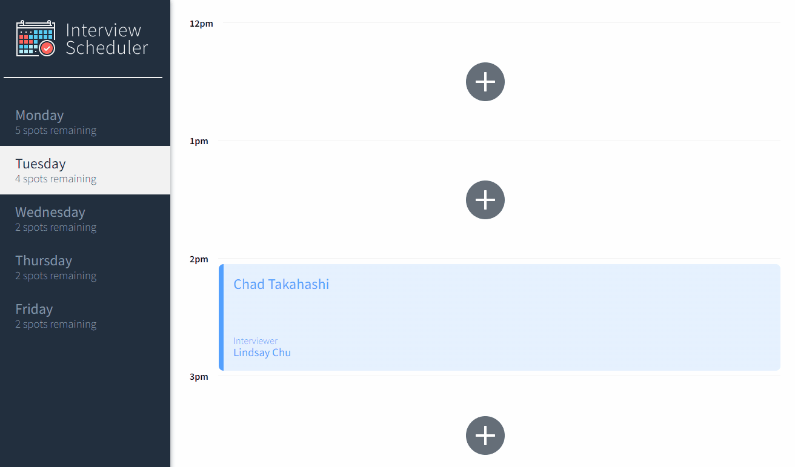
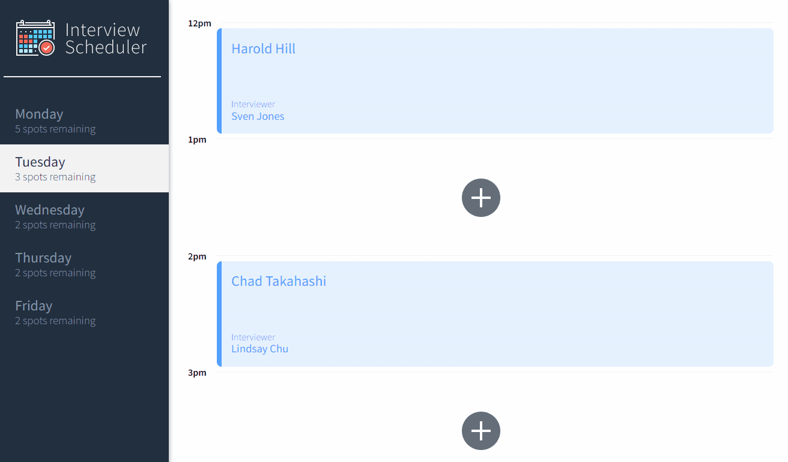

# Interview Scheduler

Interview Scheduler is a state managed single-page applciation built on React. The data is persisted on a local PostgreSQL database. All client to server communication was done using the axios library. The application is tested with Jest and Cypress throughout the duration of the project.

&emsp;
## Project Visuals 🌟


<p style="margin: auto 2em auto 2em">figure 1. Creating, editing, and deletion of an interview</p>



<p style="margin: auto 2em 2em 2em">figure 2. Error handling on unsuccessful user actions</p>

&emsp;
## Tech Stack 📚

&nbsp;&nbsp;&nbsp; Front-end: React, Javascript, Sass, axios

&nbsp;&nbsp;&nbsp; Back-end: NodeJS, Express, PostgreSQL

&nbsp;&nbsp;&nbsp; Testing: Jest, Cypress

&emsp;


## Features ✨ 
- A user can book an appointment from Mondays to Fridays from 12pm to 5pm
- A user can edit the name of the interviewee or interviewer on a scheduled appointment
- A user can delete an appointment
- Users are shown a status message in between asynchronous actions
- Number of appointments spots are dynamically updated on the vacancy on appointments
- Error status message will be shown during the case of an unsuccessful action
- Upon closing an error status the user will be directed to back to the form view prior to the action call
- Data is persisted even after the browser is refreshed or application is re-run


&emsp;
## Getting Started 🏁
1. A seperate server is required. Fork the [scheduler-api](https://github.com/ryjcm1/scheduler-api) repo and go through the listed steps
2. Fork and clone this current repo [scheduler](https://github.com/ryjcm1/scheduler)
3. Install the dependencies by running:
```
  npm install
```
4. Start the application running:
```
   npm run start
```
5. (optional) To run the test made with Jest:
```
   npm run test
```
6. (optional) To run the integration test made on cypress:
```
   npm run cypress
```
&emsp;
## Dependencies

- axios
- classnames
- normalize.css
- react
- react-dom
- react-scripts